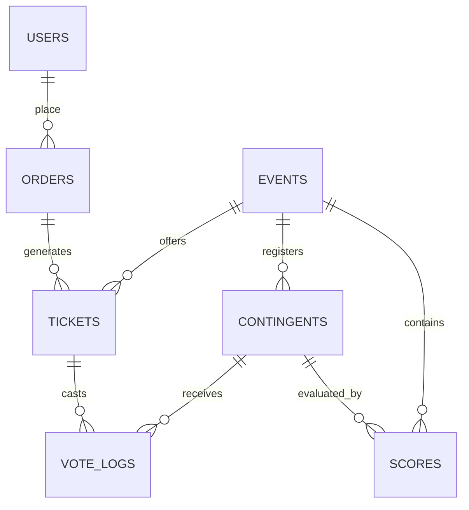

# PRODUCT DESIGN SPECIFICATION
## PASGARDA Official Multi-Event Platform

* **Version:** 1.10 (Final Approved Specification)
* **Project Type:** Multi-Event Competition & Ticketing Ecosystem
* **Organization:** Paskibra SMA Negeri 5 Samarinda
* **Main Domain:** [pasgarda.com](https://pasgarda.com) (Uji Coba: `localhost`)

---

## TABLE OF CONTENTS
1. [Executive Summary & Vision](#1-executive-summary--vision)
2. [Platform Architecture & Multi-Event Scope](#2-platform-architecture--multi-event-scope)
3. [Design System & UI Theme (Visual Brand Guidelines)](#3-design-system--ui-theme-visual-brand-guidelines)
4. [Functional Modules](#4-functional-modules)
   - 4.1. [Public Profile & Organization Hub](#41-public-profile--organization-hub)
   - 4.2. [Event Module & Schedule Matrix](#42-event-module--schedule-matrix)
   - 4.3. [Ticketing (Online & OTS) & Merchandise Sales](#43-ticketing-online--ots--merchandise-sales)
   - 4.4. [Voting Module (Favorite Contingent, Best Supporter & Social Media)](#44-voting-module-favorite-contingent-best-supporter--social-media)
   - 4.5. [Scoring Engine (First Round & The Final Round)](#45-scoring-engine-first-round--the-final-round)
   - 4.6. [Announcement & Email Broadcast Engine](#46-announcement--email-broadcast-engine)
5. [User & Admin Management Roles](#5-user--admin-management-roles)
6. [Database Schema (MySQL Tables, Fields & Data Types)](#6-database-schema-mysql-tables-fields--data-types)
7. [Directory & Project File Structure](#7-directory--project-file-structure)
8. [Technology Stack & Storage Strategy](#8-technology-stack--storage-strategy)
9. [Security & Abuse Prevention Rules](#9-security--abuse-prevention-rules)
10. [Infrastructure Cost Estimation (RAB)](#10-infrastructure-cost-estimation-rab)
11. [Technical Implementation Phases](#11-technical-implementation-phases)

---

## 1. EXECUTIVE SUMMARY & VISION

The **PASGARDA Official Platform** is a unified, scalable digital ecosystem designed for Paskibra SMA Negeri 5 Samarinda. Built to orchestrate **LOMBA BARIS GARDA 55 VOL 20 "Chequered Champions" (20–21 June 2026)** and future events.

### Core Directives & Decisions:
* **Manual Score Compilation:** Scores are written physically by judges, collected by the committee, and entered into the admin panel in the recap room.
* **Controlled Leaderboard Publication:** Ranks remain hidden until the admin publishes them at the closing ceremony.
* **Private Score Verification:** Contingent representatives log in via Email OTP to view only their own team's scorecard details.
* **Two-Tier Authentication:** Google OAuth (primary for spectators) & Email OTP (for non-Google accounts and contingent reps).
* **Dynamic Ticket Limit:** Max **15 tickets** total per user account.
* **No Global Sales Cap:** There is no total limit (no 700 online sales limit) on ticket purchases. Sales run freely for all packages.
* **Offline Re-entry:** Checked-in once in the database; subsequent exits/entries on the same day are verified physically via hand stamps.
* **OTS & Online Pricing Symmetry:** The packages (Silver, Gold, Platinum) are identical in price, validity, vote tokens, and doorprize bonuses regardless of whether they are purchased online or OTS.
* **OTS System:** Allows admin ticket generation with optional emails. Shows QR code on the admin laptop screen for buyers without emails to photograph.
* **Voting & Nilai Kontingen:** Public votes cast using ticket tokens determine the Favorite Contingent rank, which directly calculates a percentage score bonus ("Nilai Kontingen") added to the team's tournament score.
* **Instagram Likes Manual Entry:** Social media awards (Kreator Terbaik & Peserta Terfavorit) are driven by manual input of likes counts in the Admin Panel by the committee.
* **Offline Merchandise Logger:** Offline merch sales are logged manually in the Admin Panel (associated with a contingent) to dynamically compute the "Sponsor Terbaik" award.
* **Best Supporter Calculation:** Calculated by summing the **duration (validity in days)** of all tickets that voted for that specific contingent (Silver/Gold = 1 day, Platinum = 2 days).
* **Automated Pelatih Terbaik:** The coach of the team that wins **Juara Utama 1** (highest `PBB + Danton + Vafor` score) is automatically awarded **Pelatih Terbaik**. No separate manual score input is required.

---

## 2. PLATFORM ARCHITECTURE & MULTI-EVENT SCOPE

```mermaid
graph TD
    A[Public Root: pasgarda.com] --> B[Organization Profile & Hall of Fame]
    A --> C[Event Directory: pasgarda.com/events]
    C --> D[Active Event: lpbb-vol20]
    
    subgraph Event Resources (Scoped by Event Slug)
        D --> D1[Landing Page & Countdown]
        D --> D2[Ticketing & Offline Sales Logger]
        D --> D3[Voting Board: Favorite School & Supporter votes]
        D --> D4[Leaderboard with Draft/Release States]
        D --> D5[Private Contingent Portal: View Own Scores]
    end
```

---

## 3. DESIGN SYSTEM & UI THEME (VISUAL BRAND GUIDELINES)

Matching the **LOMBA BARIS GARDA 55 VOL 20 "Chequered Champions"** aesthetic (black, gold, warm red/maroon gradients, and chequered accents). The UI is structured mobile-first, ensuring high responsiveness, lightweight asset loading, and buttery-smooth animations.

### Custom Warm Color Palette (CSS Variables)
```css
:root {
  /* Dark Base Backgrounds */
  --bg-deep-black: #0D0C0A;      /* Deep Black - Main Page Background */
  --bg-dark-brown: #2A1A0A;      /* Dark Brown - Secondary Card Background */
  --bg-checker-dark: #1C1C1C;    /* Checker Dark - Grid Lines & Silent Checkers */
  
  /* Rich Gradients & Warm Accents (Military/Championship Vibe) */
  --accent-maroon: #5C1A1A;      /* Rich Maroon - Primary Brand Accent */
  --accent-burgundy: #7A2020;    /* Burgundy - Hover State Gradients */
  --accent-mahogany: #8B3A1C;    /* Mahogany - Warnings & Live Indicators */
  --glow-warm: #C45A00;          /* Warm Glow - Fire/Spark Highlights */
  
  /* Metallic & Gold Scales (Championship/Gold Theme) */
  --gold-primary: #C8930A;       /* Golden - Core Gold Theme Color */
  --gold-bright: #E8AB10;        /* Bright Gold - Actionable Button Hover State */
  --gold-light: #F5C842;         /* Light Gold - Subheadings & Star Highlights */
  --gold-cream: #F7E090;         /* Cream Gold - Glow Halos & Drop-Shadows */
  --gold-checker: #B8860B;       /* Checker Gold - Decorative Accents */
  --bronze-muted: #8C6828;       /* Muted Bronze - Small captions & borders */
  
  /* Text & Contrast Scales */
  --text-primary: #F2EDD6;       /* Off-White - Main Reading Text */
  --text-muted: #8C6828;         /* Muted Bronze - Secondary Labels */
}
```

---

## 4. FUNCTIONAL MODULES

### 4.1. Public Profile & Organization Hub
* **History & Hall of Fame:** Record of winners by year (Champion, Runner Up, Best Commander, Favorite Champion).
* **News Portal:** Categories: *Competition*, *Organization*, *Announcement*, and *Achievement*.

### 4.2. Event Module & Schedule Matrix
* **Category Splits:**
  * **Day 1 (20 June 2026):** U-16 (SMP) & Purna/Senior.
  * **Day 2 (21 June 2026):** U-12 (SD) & U-19 (SMA).
* **Registration Portal:** Form fields exist in code, but UI shows **"Registration Closed"** for this event.

### 4.3. Ticketing (Online & OTS) & Merchandise Sales
The packages (Silver, Gold, Platinum) are symmetric and can be purchased either online or OTS:
* **Silver Package:** Rp 25.000, 1-Day (Flexible), **1 Vote**, includes 1 Doorprize Coupon.
* **Gold Package:** Rp 40.000, 1-Day (Flexible), **2 Votes**, includes 1 Doorprize Coupon.
* **Platinum Package:** Rp 50.000, 2-Day, **3 Votes**, includes 2 Doorprize Coupons. (Online/OTS Platinum purchases restricted to Day 1 only).
* **Sales Channel Integrations:**
  * **Online Purchases:** Checkout via Midtrans Snap. Dynamic QR ticket emailed.
  * **OTS Purchases:** Admin can generate a ticket in the database. Entering the customer's email is optional. If not provided, the QR code displays on the admin's laptop screen for the buyer to photograph.
* **Single-Scan Logic:** Scanned QR code updates status to `checked_in = true`. Subsequent entries are verified physically using hand stamps.
* **Offline Merchandise Logger:** Logs transactions manually in the dashboard, linking purchases to the supported school/contingent to calculate the **Sponsor Terbaik** award.

### 4.4. Voting Module (Favorite Contingent, Best Supporter & Social Media)
* **Best Supporter:** Calculated by summing the **duration (days of validity)** of all tickets that voted for that specific contingent:
  * Silver Ticket Vote = +1 Day Duration Score
  * Gold Ticket Vote = +1 Day Duration Score
  * Platinum Ticket Vote = +2 Days Duration Score
* **Social Media Likes System:** Leaderboards for *Kreator Terbaik* and *Peserta Terfavorit* are updated via manual entry of Instagram likes counts in the Admin dashboard by panitia.

### 4.5. Scoring Engine (First Round & The Final Round)
* **Juara Utama Standings:** Calculated by summing:
  $$\text{Juara Utama Score} = \text{PBB} + \text{Danton} + \text{Vafor}$$
* **Pelatih Terbaik:** Automatically awarded to the coach of the contingent that wins **Juara Utama 1**.
* **"The Final" Selection:** The top 2 teams in the **U-16 (SMP)** and **U-19 (SMA)** categories advance to "The Final" based on the selection score:
  $$\text{Selection Score} = \text{PBB} + \text{Danton} + \text{Vafor} + \text{Nilai Kontingen}$$
* **Nilai Kontingen Bonus:** Calculated dynamically by voting rank percentage:
  * **Rank 1 Vote:** $+1\%$ of (PBB + Danton)
  * **Rank 2 Vote:** $+0.8\%$ of (PBB + Danton)
  * **Rank 3 Vote:** $+0.6\%$ of (PBB + Danton)
  * **Rank 4 Vote:** $+0.4\%$ of (PBB + Danton)
  * **Rank 5 Vote:** $+0.3\%$ of (PBB + Danton)
  * **Rank 6 Vote:** $+0.2\%$ of (PBB + Danton)
  * **Rank 7 Vote:** $+0.1\%$ of (PBB + Danton)
  * **Rank 8 and below:** $0\%$ bonus.

---

## 5. USER & ADMIN MANAGEMENT ROLES

| Role | Access Scope | Key Capabilities |
| :--- | :--- | :--- |
| **Super Admin** | Platform-Wide | Full access, template settings, API config. |
| **Committee/Organizer**| Event-Scoped | Input paper scores, generate OTS tickets, toggle leaderboard release, trigger bulk email broadcasts, manage "The Final" participants, log merch sales. |
| **Operator/Gate Staff** | Utility-Scoped | Scan QR check-ins. |
| **Contingent Rep** | School-Scoped | OTP email login to view own team's private draft scorecard. |
| **Spectator (User)** | Public Frontend | Purchase tickets, vote for favorite contingents. |

---

## 6. DATABASE SCHEMA (MySQL Tables, Fields & Data Types)



### 6.1. Table: `users`
Tracks spectators, representatives, and administrative roles.
* `id` **BIGINT UNSIGNED (PK, Auto Increment)**
* `name` **VARCHAR(255)**
* `email` **VARCHAR(255) (UNIQUE)**
* `role` **ENUM('super_admin', 'committee', 'operator', 'spectator') (DEFAULT 'spectator')**
* `google_id` **VARCHAR(255) (NULLABLE, INDEX)**
* `otp_code` **VARCHAR(6) (NULLABLE)**
* `otp_expires_at` **TIMESTAMP (NULLABLE)**
* `created_at` **TIMESTAMP (NULLABLE)**
* `updated_at` **TIMESTAMP (NULLABLE)**

### 6.2. Table: `events`
Scopes configuration, statuses, and calculations per event.
* `id` **BIGINT UNSIGNED (PK, Auto Increment)**
* `slug` **VARCHAR(255) (UNIQUE)**
* `name` **VARCHAR(255)**
* `description` **TEXT (NULLABLE)**
* `date_start` **DATE**
* `date_end` **DATE**
* `venue` **VARCHAR(255)**
* `status` **ENUM('draft', 'active', 'archived') (DEFAULT 'draft')**
* `max_tickets_per_user` **INT (DEFAULT 15)**
* `leaderboard_status` **ENUM('draft', 'published') (DEFAULT 'draft')**
* `created_at` **TIMESTAMP (NULLABLE)**
* `updated_at` **TIMESTAMP (NULLABLE)**

### 6.3. Table: `contingents`
Stores participating school/team information.
* `id` **BIGINT UNSIGNED (PK, Auto Increment)**
* `event_id` **BIGINT UNSIGNED (FK -> events.id, ON DELETE CASCADE)**
* `school_name` **VARCHAR(255)**
* `region` **VARCHAR(255)**
* `category_type` **ENUM('U12', 'U16', 'U19', 'Purna')**
* `logo_path` **VARCHAR(255) (NULLABLE)**
* `description` **TEXT (NULLABLE)**
* `status` **ENUM('pending', 'verified') (DEFAULT 'pending')**
* `coach_name` **VARCHAR(255)**
* `coach_phone` **VARCHAR(20)**
* `created_at` **TIMESTAMP (NULLABLE)**
* `updated_at` **TIMESTAMP (NULLABLE)**

### 6.4. Table: `ticket_packages`
Configures dynamic ticket packages and pricing structures.
* `id` **BIGINT UNSIGNED (PK, Auto Increment)**
* `event_id` **BIGINT UNSIGNED (FK -> events.id, ON DELETE CASCADE)**
* `name` **VARCHAR(100)** *(e.g., 'Silver', 'Gold', 'Platinum')*
* `price` **DECIMAL(10, 2)**
* `validity_days` **INT (DEFAULT 1)**
* `vote_allowance` **INT (DEFAULT 1)**
* `stock` **INT (NULLABLE)**
* `is_active` **BOOLEAN (DEFAULT TRUE)**
* `created_at` **TIMESTAMP (NULLABLE)**
* `updated_at` **TIMESTAMP (NULLABLE)**

### 6.5. Table: `orders`
Logs payment logs from Midtrans.
* `id` **BIGINT UNSIGNED (PK, Auto Increment)**
* `user_id` **BIGINT UNSIGNED (FK -> users.id, ON DELETE CASCADE)**
* `event_id` **BIGINT UNSIGNED (FK -> events.id, ON DELETE CASCADE)**
* `midtrans_transaction_id` **VARCHAR(255) (UNIQUE)**
* `total_price` **DECIMAL(10, 2)**
* `payment_status` **ENUM('pending', 'paid', 'expired', 'failed') (DEFAULT 'pending')**
* `payment_method` **VARCHAR(50) (NULLABLE)**
* `created_at` **TIMESTAMP (NULLABLE)**
* `updated_at` **TIMESTAMP (NULLABLE)**

### 6.6. Table: `issued_tickets`
Tracks individual generated tickets and scans.
* `id` **BIGINT UNSIGNED (PK, Auto Increment)**
* `order_id` **BIGINT UNSIGNED (FK -> orders.id, ON DELETE CASCADE)**
* `ticket_package_id` **BIGINT UNSIGNED (FK -> ticket_packages.id)**
* `unique_qr_hash` **VARCHAR(255) (UNIQUE)**
* `buyer_name` **VARCHAR(255)**
* `buyer_email` **VARCHAR(255) (NULLABLE)**
* `check_in_status` **BOOLEAN (DEFAULT FALSE)**
* `checked_in_at` **TIMESTAMP (NULLABLE)**
* `vote_tokens_remaining` **INT**
* `created_at` **TIMESTAMP (NULLABLE)**
* `updated_at` **TIMESTAMP (NULLABLE)**

### 6.7. Table: `vote_logs`
Enforces trace integrity and protects against double-voting.
* `id` **BIGINT UNSIGNED (PK, Auto Increment)**
* `event_id` **BIGINT UNSIGNED (FK -> events.id, ON DELETE CASCADE)**
* `issued_ticket_id` **BIGINT UNSIGNED (FK -> issued_tickets.id, ON DELETE CASCADE)**
* `contingent_id` **BIGINT UNSIGNED (FK -> contingents.id, ON DELETE CASCADE)**
* `created_at` **TIMESTAMP (NULLABLE)**

### 6.8. Table: `scores`
Core compilation records for first-round evaluation.
* `id` **BIGINT UNSIGNED (PK, Auto Increment)**
* `event_id` **BIGINT UNSIGNED (FK -> events.id, ON DELETE CASCADE)**
* `contingent_id` **BIGINT UNSIGNED (FK -> contingents.id, ON DELETE CASCADE)**
* `pbb_score` **DECIMAL(5, 2) (DEFAULT 0.00)**
* `danton_score` **DECIMAL(5, 2) (DEFAULT 0.00)**
* `vafor_score` **DECIMAL(5, 2) (DEFAULT 0.00)**
* `kostum_score` **DECIMAL(5, 2) (DEFAULT 0.00)**
* `makeup_score` **DECIMAL(5, 2) (DEFAULT 0.00)**
* `penalties_score` **DECIMAL(5, 2) (DEFAULT 0.00)**
* `nilai_kontingen_bonus` **DECIMAL(5, 2) (DEFAULT 0.00)**
* `grand_total` **DECIMAL(6, 2) (DEFAULT 0.00)**
* `created_at` **TIMESTAMP (NULLABLE)**
* `updated_at` **TIMESTAMP (NULLABLE)**

### 6.9. Table: `score_pbb_details`
Audit logs for the 31 (or 23) manual PBB movement checkboxes.
* `id` **BIGINT UNSIGNED (PK, Auto Increment)**
* `score_id` **BIGINT UNSIGNED (FK -> scores.id, ON DELETE CASCADE)**
* `movement_index` **INT**
* `score` **DECIMAL(3, 2) (DEFAULT 0.00)**
* `created_at` **TIMESTAMP (NULLABLE)**

### 6.10. Table: `scores_final_round`
Scores for the top 2 qualifying finalists.
* `id` **BIGINT UNSIGNED (PK, Auto Increment)**
* `event_id` **BIGINT UNSIGNED (FK -> events.id, ON DELETE CASCADE)**
* `contingent_id` **BIGINT UNSIGNED (FK -> contingents.id, ON DELETE CASCADE)**
* `score_juri_1` **DECIMAL(5, 2) (DEFAULT 0.00)**
* `score_juri_2` **DECIMAL(5, 2) (DEFAULT 0.00)**
* `penalties` **DECIMAL(5, 2) (DEFAULT 0.00)**
* `total_score` **DECIMAL(6, 2) (DEFAULT 0.00)**
* `created_at` **TIMESTAMP (NULLABLE)**
* `updated_at` **TIMESTAMP (NULLABLE)**

### 6.11. Table: `merchandise_sales`
Logs manual sales entries to resolve **Sponsor Terbaik**.
* `id` **BIGINT UNSIGNED (PK, Auto Increment)**
* `event_id` **BIGINT UNSIGNED (FK -> events.id, ON DELETE CASCADE)**
* `contingent_id` **BIGINT UNSIGNED (FK -> contingents.id, ON DELETE CASCADE)**
* `buyer_name` **VARCHAR(255)**
* `qty` **INT (DEFAULT 1)**
* `total_price` **DECIMAL(10, 2)**
* `created_at` **TIMESTAMP (NULLABLE)**

### 6.12. Table: `social_media_likes`
Captures manual entries for Kreator & Peserta Terfavorit.
* `id` **BIGINT UNSIGNED (PK, Auto Increment)**
* `contingent_id` **BIGINT UNSIGNED (FK -> contingents.id, ON DELETE CASCADE)**
* `likes_count_reels` **INT (DEFAULT 0)**
* `likes_count_posts` **INT (DEFAULT 0)**
* `updated_at` **TIMESTAMP (NULLABLE)**

---

## 7. DIRECTORY & PROJECT FILE STRUCTURE

Organized folder layout for   

```
pasgarda-platform/
├── app/
│   ├── Http/
│   │   ├── Controllers/
│   │   │   ├── Admin/
│   │   │   │   ├── AdminDashboardController.php   # General stats, dynamic limits config
│   │   │   │   ├── BroadcasterController.php      # Bulk announcement emails
│   │   │   │   ├── ScoreController.php            # Recap scoring entries & checklist forms
│   │   │   │   └── TicketController.php           # OTS ticketing generation & scan logger
│   │   │   ├── Auth/
│   │   │   │   ├── GoogleAuthController.php       # OAuth callback and spectator logic
│   │   │   │   └── OtpAuthController.php          # Email OTP authentication logic
│   │   │   ├── EventController.php                # Show dynamic landing countdown details
│   │   │   ├── PublicController.php               # Front page history, news, profile
│   │   │   └── TicketCheckoutController.php       # Midtrans Snap online payments hook
│   │   └── Middleware/
│   │       └── HandleInertiaRequests.php          # Shared inertia properties (user role, etc.)
│   └── Models/
│       ├── Event.php
│       ├── Contingent.php
│       ├── TicketPackage.php
│       ├── Order.php
│       ├── IssuedTicket.php
│       ├── Score.php
│       ├── ScorePbbDetail.php
│       ├── ScoreFinalRound.php
│       ├── MerchandiseSale.php
│       └── SocialMediaLike.php
├── bootstrap/
│   └── app.php                                    # Core routing, Inertia middleware registry
├── config/
│   └── midtrans.php                               # Sandbox / production API credentials
├── database/
│   └── migrations/                                # Scoped database schema files
│       ├── 2026_06_04_000001_create_events_table.php
│       ├── 2026_06_04_000002_create_users_table.php
│       ├── 2026_06_04_000003_create_contingents_table.php
│       ├── 2026_06_04_000004_create_ticket_packages_table.php
│       ├── 2026_06_04_000005_create_orders_table.php
│       ├── 2026_06_04_000006_create_issued_tickets_table.php
│       ├── 2026_06_04_000007_create_vote_logs_table.php
│       ├── 2026_06_04_000008_create_scores_table.php
│       ├── 2026_06_04_000009_create_score_pbb_details_table.php
│       ├── 2026_06_04_000010_create_scores_final_round_table.php
│       ├── 2026_06_04_000011_create_merchandise_sales_table.php
│       └── 2026_06_04_000012_create_social_media_likes_table.php
├── resources/
│   ├── css/
│   │   └── app.css                                # Design token classes, mobile-first utilities
│   ├── js/
│   │   ├── Pages/                                 # React single-page views
│   │   │   ├── Welcome.jsx                        # Homepage profile, organization details
│   │   │   ├── Event/
│   │   │   │   ├── Show.jsx                       # Countdown, statistics, categories list
│   │   │   │   ├── Tickets.jsx                    # Checkout forms & package selection
│   │   │   │   ├── Leaderboard.jsx                # Spectator standings (released via admin)
│   │   │   │   └── MyScore.jsx                    # Contingent reps private scorecard review
│   │   │   ├── Admin/
│   │   │   │   ├── Dashboard.jsx                  # Control panel metrics & dynamic limits

│   │   │   │   ├── OtsTickets.jsx                 # OTS ticketing manual panel
│   │   │   │   ├── Merchandise.jsx                # Sponsor Terbaik logger
│   │   │   │   ├── SocialMedia.jsx                # Instagram likes manual updater
│   │   │   │   └── EmailBroadcast.jsx             # Bulk mail sender form
│   │   │   └── Auth/
│   │   │       └── Login.jsx                      # Google OAuth / Email OTP interface
│   │   └── app.jsx                                # Inertia app instantiator
│   └── views/
│       └── app.blade.php                          # Core server blade template containing @inertia
├── routes/
│   └── web.php                                    # Web routes (public & admin dashboards)
├── vite.config.js                                 # Vite config using @vitejs/plugin-react
└── package.json                                   # NPM script compile tasks
```

---

## 8. TECHNOLOGY STACK & STORAGE STRATEGY

* **Backend Engine:** Laravel 12
* **Build Tool:** Vite + Node.js
* **Database Management:** MySQL 8 + phpMyAdmin
* **Frontend UI:** React + Inertia.js (Mobile-optimized, smooth CSS transitions, lightweight).
* **Storage:** Local VPS storage (`storage/app/public`).

---

## 9. SECURITY & ABUSE PREVENTION RULES

* **Self-Voting Block:** Users associated with a contingent are blocked from voting for their own school.
* **OTP Limit:** Rate-limiting OTP dispatch requests (max 1/minute per email).

---

## 10. INFRASTRUCTURE COST ESTIMATION (RAB)

| No | Item / Service | Specification | Duration / Qty | Estimated Cost (IDR) |
| :--- | :--- | :--- | :--- | :--- |
| 1 | **VPS Hosting (Cloud)** | 2 vCPU, 4GB RAM, 80GB SSD | 1 Month | Rp 180.000 - Rp 250.000 |
| 2 | **Domain Name** | `.com` or `.id` | 1 Year | Rp 135.000 - Rp 160.000 |
| 3 | **SSL Certificate** | Let's Encrypt SSL | Lifetime | **Rp 0 (FREE)** |
| 4 | **SMTP Mail Relay** | Brevo / Mailgun | 1 Month | **Rp 0 (FREE)** |
| **TOTAL** | | | | **Rp 315.000 - Rp 410.000** |

---

## 11. TECHNICAL IMPLEMENTATION PHASES

* **Phase 1: Foundation & Auth:** Setup Laravel 12 + Inertia React + phpMyAdmin Database. Integrate Google OAuth & OTP.
* **Phase 2: Event Directory & Contingents:** Setup dynamic event settings, dynamic ticket packages, and contingent school directory.
* **Phase 3: Ticketing & Midtrans Integration:** Core online checkout and dynamic OTS admin ticket generation.
* **Phase 4: Scoring Engine:** Score inputs (31/23 PBB movements, Danton, Vafor) and automatic penalty calculation.
* **Phase 5: Voting & Nilai Kontingen:** Real-time WebSockets voting, calculation of contingent rank bonuses, and top 2 "The Final" trigger.
* **Phase 6: Admin Dashboard & Broadcaster:** Broadcaster email builder, leaderboard publication toggle, and gate operator views.
